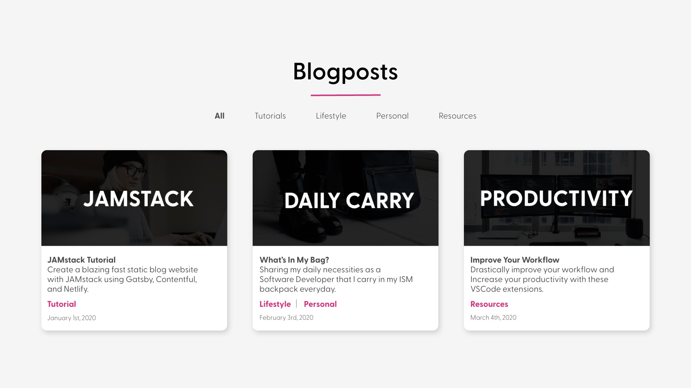

# **Building a JAMstack Blog**
## Using Gatsby, Contentful, and Netlify

#### **Created for you, by [Morgan Richardson](https://www.instagram.com/morgan.codes)**

In this tutorial, we will create a blazing fast static blog website hosted with [Netlify](https://www.netlify.com) using [Gatsby](https://www.gatsbyjs.org) on the client and [Contentful](https://www.contentful.com) as our headless CMS, which serves our content. By the end of this tutorial, you'll have created a fully functional blog site to share with the world! 

This tutorial uses [JAMstack](https://jamstack.org/), which is a modern web development architecture based on client-size **J**avaScript, reusable **A**PIs, and prebuilt **M**arkup. This architecture allows us to create blazing fast, secure, dynamic apps that are served without web servers.

In this repository, you will find two folders: gatsby-tutorial-starter-template and gatsby-tutorial-final. If you're following along with this YouTube video, start with the starter template. If you're familiar with JAMstack or don't want to go through the tutorial, go ahead and use the final. 

## Getting Started
